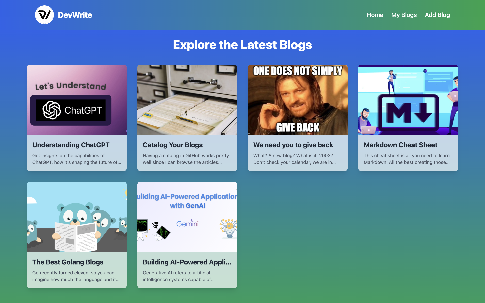
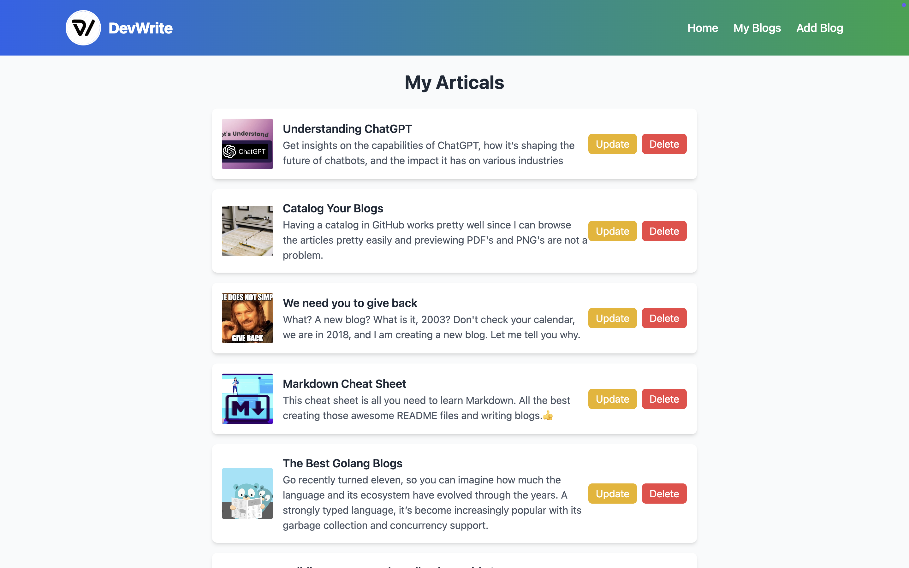
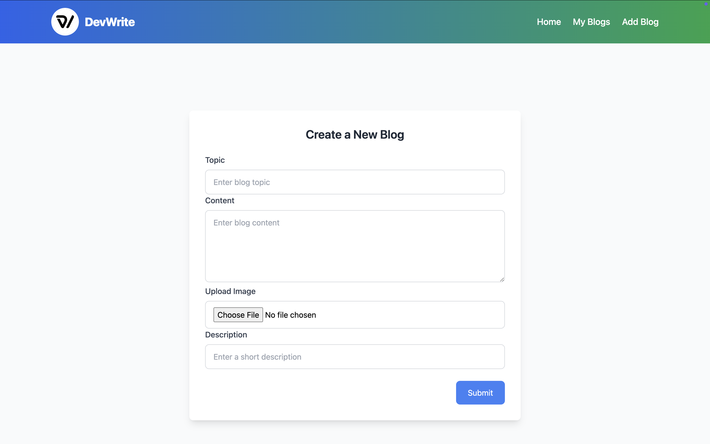
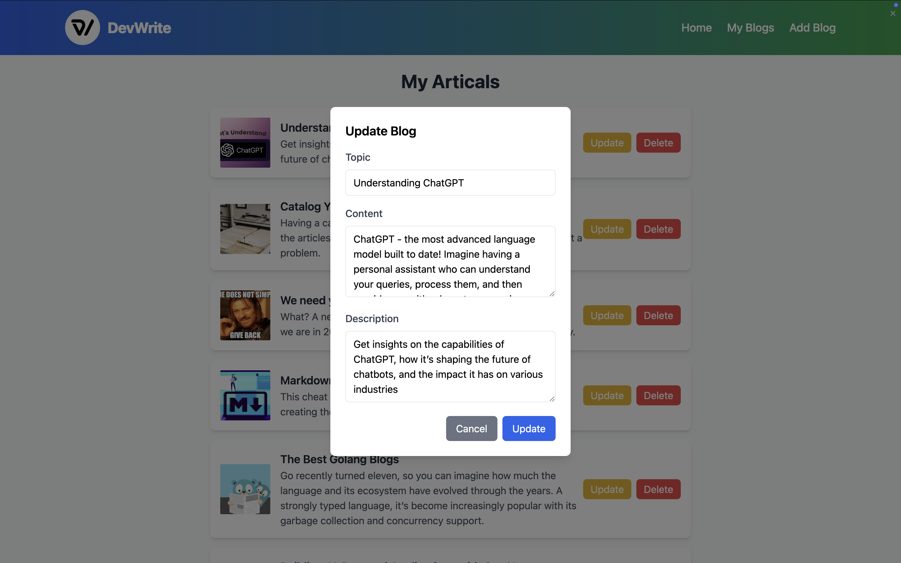

# DevWrite - Blog Application

## Overview

DevWrite is a modern blog application built with **Laravel** for the backend and **React** for the frontend. It provides a platform for users to create, view, and manage blogs seamlessly.

## Tech Stack

- **Backend**:  
  - **Laravel**  
  - REST API for handling data interactions.

- **Frontend**:  
  - **React** 
  - Tailwind CSS.

## Features

- Create, update, and delete blogs.
- View detailed blog information.
- Responsive design optimized for both desktop and mobile devices.

## Screenshots

  
**Home Page**

  
**Blog List**

  
**Add Blog**

  
**Update Blog**

  
**Blog**

